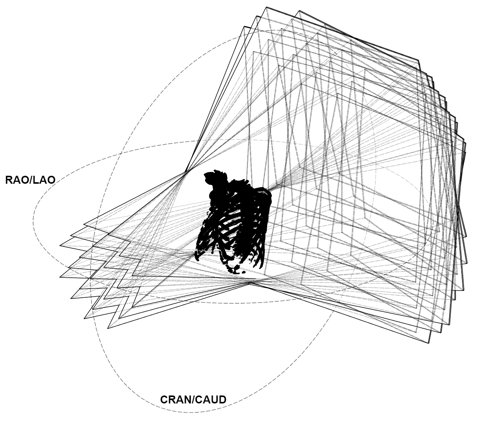
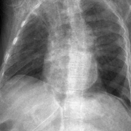
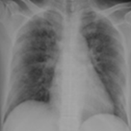

# (GENSYN) Generating Synthetic x-ray Images using SyntheX

This is the repository for Casper Anton Poulsen and Michelle Hestbek-Møller Masters Thesis done at The IT University of Copenhagen in Spring of 2024. This repo is split into 5 different sections

* Data - Here is all the information on how to use custom download scripts
* DeepDRR - This section explains how to use the DeepDRR scripts we have created and how to use the digital C-arm
* SyntheX - This section explains how to train the CycleGAN using our setup
* Model training - This section will show you how to recreate our model training setup
* Radiologist Experiment - This setion goes through how to recreate our experimental setup for a qualitative analysis of synthetic images

All of these sections have different requirements, outside of just python packages. Different cuda versions are required for each step, because of compatibility issues with the tools used in this project. It is therefor recommended if you wish to run this locally to use something like Nvidias cuda docker container tool [https://hub.docker.com/r/nvidia/cuda]() to change your cuda version on the fly. In our case we had access to a cluster through the Pioneer Center for AI in Copenhagen [https://www.aicentre.dk/]() which allowed for easy switching between versions.

## Data

This project used a lot of different data sets, most of which are publically available but has not direct download method. For this purpose we have created scripts to more easily download them. This is for the Radchest data set and LIDC-IDRI lung nodule data set.

### Radchest downloader

To use this data set you should apply for permission to get a token at [https://zenodo.org/records/6406114]() . Once you have this token, simply replace it either in the dedicated notebook data_prep/radchest-download.ipynb or the download script data_prep/radchest-download.py. Both scripts will download the data into the

### NBIA downloader

This repository uses data from the Cancer Imaging Archive. To download data from the archieve you would usually have to use the NBIA Data Retriever. In this repo we have used the TCIA wrapper for the NBIA api to create a data retriever that does not require the desktop app and can be submitted to cluster schedulars like LSF10 and SLURM

The nbia_downloader.py takes two command line arguments --output-dir and --collection-name

Example run:

`$ python3 /home/caap/Thesis-Synthex/nbia_downloader.py --output-dir /home/data_shares/purrlab_students/LIDC-IDRI --collection-name LIDC-IDRA`

### Carbontracker

All scripts submitted to a cluster in this repository uses the carbontracker[ https://github.com/lfwa/carbontracker]()

The logs are stored in /carbon_logs/ and to summarize the logs, simply run;

`$ python3 carbon_summary.py`

## DeepDRR

### Data conversion

The data sets required for this sections are ImagEng, LIDC-IDRI and RadChest.

All of these CT data sets are in different formats:

* ImagEng is in the NRRD format
* LIDC-IDRI contains DICOM volumes
* RadChest is in Numpy arrays

We need to convert all of these data sets to the Nifti file format for CT scans for them to be compatible with DeepDRR. To convert the ImagEng data use the conversion\convert_nrrd_to_nifti.ipynb notebook to use this file you have to run

```bash
cd conversion
pip install -r requirements.txt
```

To convert the LIDC-IDRI data set you will need a different conversion library, specifically dicom2nifti. Firstly run;

```
cd dicom2nifti
pip install .
```

Then you can run the code within the data_prep\lidc-idri-convertion.ipynb notebook.

Finally to convert the RadChest data set you simply have to run all of the code within, presupposing you have installed the requirements from the previous steps, the data_prep\numpy_to_nifti.ipynb notebook

### Run DeepDRR code

Requirements:

* Nvidia CUDA 11.8
* pip install deepdrr

in the DeepDRR repository there are dedicated files for each data set, that expects the file layout created from the CT volume conversion files.

### How to control the digital C-ARM



In the deepdrr\deepdrr-spacial-sampling.ipynb notebook you will find the code in order to rotate to subject along the isocenter of the volume. In the function you can change the alpha and beta values. These encode for cran/caud and rao/lao respectively. To load any volume with the V-net segmentation model you will need a GPU with atleast 8gb of VRAM. If you do not posess this kind of hardware, running with thresholding will allow you to run the code at the cost of worse DRR images.

## SyntheX

### Data prep

In order to run the training you will need to prepare the training data. To prepare the Padchest data run these two commands;

```
python3 data_prep/resize_padchest.py
python3 data_prep/sample_padchest_synthex.py
```

Then run the data splits code within the synthex/cyclegan.ipynb notebook

### Usage

The requirements for Synthex are;

* Nvidia CUDA 12.3
* Nvidia cudnn 8.9
* Tensorflow 2.16
* Keras 3

In order to run the synthex conversions follow the instructions in the pytorch-CycleGAN-and-pix2pix folder, or if you just want to recreate the same images we have, the following code block to train the model

```
python3 pytorch-CycleGAN-and-pix2pix/train.py \
     --dataroot /dtu/p1/johlau/Thesis-Synthex/synthex/data \
     --input_nc 1 \
     --output_nc 1 \
     --max_dataset_size 1024 \
     --checkpoints_dir /dtu/p1/johlau/Thesis-Synthex/synthex/data/pytorch_model \
     --name synthex_512 \
     --load_size 552 \
     --crop_size 512
```

In order to generate the images run these two code blocks to generate the center and angled images respectively

```
python3 pytorch-CycleGAN-and-pix2pix/test.py \
    --dataroot /dtu/p1/johlau/Thesis-Synthex/data/RAD-ChestCT-DRR-CROPPED \
    --name synthex_512 \
    --model test \
    --load_size 512 \
    --crop_size 512 \
    --preprocess none \
    --results_dir /dtu/p1/johlau/Thesis-Synthex/data/RAD-ChestCT-Synthex \
    --checkpoints_dir /dtu/p1/johlau/Thesis-Synthex/synthex/data/pytorch_model \
    --dataset_mode single \
    --netG resnet_9blocks \
    --netD basic \
    --no_dropout \
    --norm instance \
    --no_flip \
    --direction AtoB \
    --input_nc 1 \
    --output_nc 1 \
    --num_test -1
```

```
python3 pytorch-CycleGAN-and-pix2pix/test.py \
    --dataroot /dtu/p1/johlau/Thesis-Synthex/data/RAD-ChestCT-DRR-angled-CROPPED \
    --name synthex_512 \
    --model test \
    --load_size 512 \
    --crop_size 512 \
    --preprocess none \
    --results_dir /dtu/p1/johlau/Thesis-Synthex/data/RAD-ChestCT-Synthex-angled \
    --checkpoints_dir /dtu/p1/johlau/Thesis-Synthex/synthex/data/pytorch_model \
    --dataset_mode single \
    --netG resnet_9blocks \
    --netD basic \
    --no_dropout \
    --norm instance \
    --no_flip \
    --direction AtoB \
    --input_nc 1 \
    --output_nc 1 \
    --num_test -1
```

## Classification

First you need these requirements to run the code;

* Nvidia CUDA 12.2
* Keras 3.2
* Jax[CUDA=12]

To run the classification you will need to run all of the code in data_prep/padchest_splits.ipynb as it generates the splits needed for the training. You also need to run the data_prep/chestx-ray8.ipynb notebook to have the last splits. Afterwards you can run everything in the previous section on SyntheX in order to get that training images from there.

To train all of the models run the following code blocks (It might be adviseable to split this into multiple steps)

```
python3 classification/train_model.py --split-idx 1 --model-name synthex-center --radchest-samples 1 --model-dir /dtu/p1/johlau/Thesis-Synthex/models/ --data-dir /dtu/p1/johlau/Thesis-Synthex/data/ --epochs 30 --learning-rate 0.00001 --batch-size 128 --use-syntex 
python3 classification/train_model.py --split-idx 2 --model-name synthex-center --radchest-samples 1 --model-dir /dtu/p1/johlau/Thesis-Synthex/models/ --data-dir /dtu/p1/johlau/Thesis-Synthex/data/ --epochs 30 --learning-rate 0.00001 --batch-size 128 --use-syntex 
python3 classification/train_model.py --split-idx 0 --model-name synthex-center --radchest-samples 1 --model-dir /dtu/p1/johlau/Thesis-Synthex/models/ --data-dir /dtu/p1/johlau/Thesis-Synthex/data/ --epochs 30 --learning-rate 0.00001 --batch-size 128 --use-syntex 
python3 classification/train_model.py --split-idx 3 --model-name synthex-center --radchest-samples 1 --model-dir /dtu/p1/johlau/Thesis-Synthex/models/ --data-dir /dtu/p1/johlau/Thesis-Synthex/data/ --epochs 30 --learning-rate 0.00001 --batch-size 128 --use-syntex 
python3 classification/train_model.py --split-idx 4 --model-name synthex-center --radchest-samples 1 --model-dir /dtu/p1/johlau/Thesis-Synthex/models/ --data-dir /dtu/p1/johlau/Thesis-Synthex/data/ --epochs 30 --learning-rate 0.00001 --batch-size 128 --use-syntex 

```

This is an example of how to do train a model with 5 folds cross validation with 1x sampling with synthex. If you want to see how all of the models were trained, look in the jobs/lsf10/classification/ folder for all of the jobs run

To evaluate the model run these 4 scripts;

```
python3 classification/get_preds_padchest.py
python3 classification/get_preds_chestx-ray14.py
python3 classification/get_preds_padchest_synthex.py
python3 classification/get_preds_chestx-ray14_synthex.py
```

To aggregate and visualize all of these results along with the AUC training plots, go to the classification/results.ipynb notebook and run all cells

## Experimental setup (Qualitative study)

When working with synthetic images a concern is the images degree of realism. Are the synthetic images easy to
differ from real images? To check the quality of the produced synthetic images we want present a series of real and synthetic images to multiple radiologist with varying years of expertise. The dataset consist of 50 to 100 different chest
x-ray images with a mixture of synthetic and real images. The dataset will consist of synthetic images created from the covid-19 ct scan dataset,images created from (ImagEng) both following the SyntheX method and real images from (QaTa-COV19).

All images were shuffled and no image information was given. When scoring the images we followed the method used in Ali, Murad, and Shah (Spot the fake article). The radiologist were asked to state if the given image was real, fake or they were uncertain. When the radiologist rated an image as fake or uncertain a follow up box appered where they could explain why they rated as such.

After the radiologist have completed looking at all the images, a follow up interview is conducted so they can explain their findings especially what made them rate an image fake.

Synthetic image:



Real image:



## Weekly log

## Todo list

### Current

### Backlog
